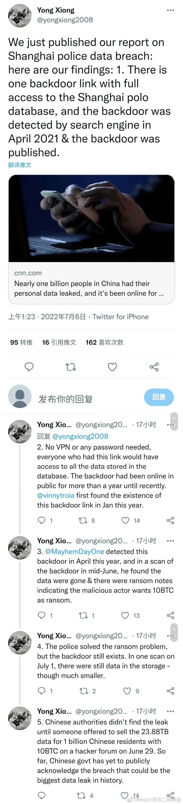
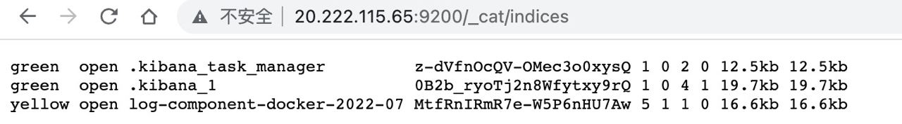
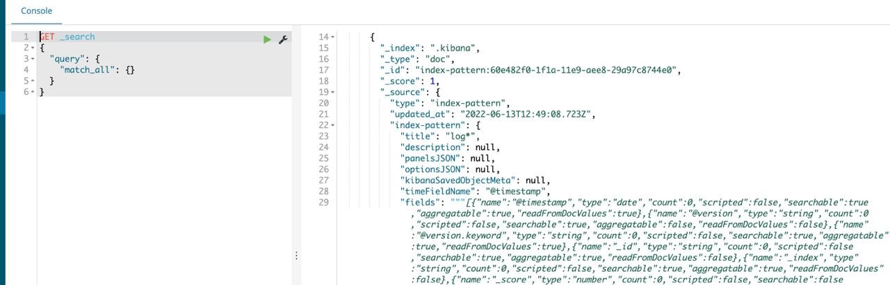

https://edition.cnn.com/2022/07/05/china/china-billion-people-data-leak-intl-hnk/index.html

https://www.wsj.com/articles/china-police-database-was-left-open-online-for-over-a-year-enabling-leak-11657119903

1. https://x.com/MayhemDayOne/status/1544371470205419522?s=20&t=5O_RuUnwZFW-_8al6RneTga

https://medium.com/@InfoSecIta/kibana-the-new-toy-for-pentesters-bughunters-hackers-e72048bd98b0

https://blog.leakix.net/2022/07/what-we-know-about-the-china-leak/

